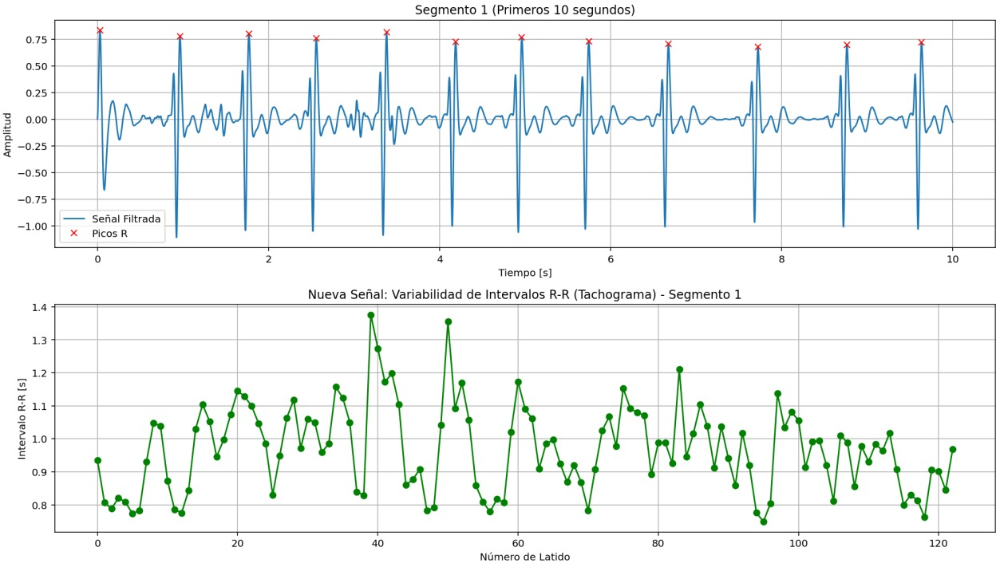
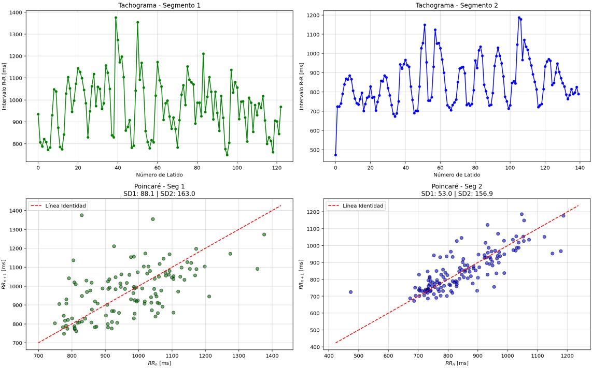

  
# Variabilidad de la frecuencia cardíaca y balance autonómico 
## Quinto laboratorio de procesamiento digital de señales

**Maria Camila Ospina Jara, Juan Felipe Serna Alarcón**
## Descripción
La práctica consistió en analizar la variabilidad de la frecuencia cardíaca (HRV) a partir de señales ECG en reposo y durante lectura en voz alta. Se aplicaron filtros digitales, se calcularon intervalos R-R y parámetros HRV, y se utilizaron diagramas de Poincaré para evaluar el balance autonómico.
## Introducción
La variabilidad de la frecuencia cardíaca (HRV) es una herramienta utilizada para evaluar la regulación del sistema nervioso autónomo sobre la actividad cardíaca a partir de los intervalos R-R obtenidos de una señal electrocardiográfica (ECG). Su análisis permite identificar cambios asociados a la actividad simpática y parasimpática frente a diferentes estímulos fisiológicos.

En esta práctica se adquirieron señales ECG en condiciones de reposo y lectura en voz alta, con el fin de analizar las variaciones en la HRV. Posteriormente, se aplicaron técnicas de procesamiento digital de señales, incluyendo filtrado, detección de picos R y construcción de diagramas de Poincaré, para comparar el comportamiento autonómico en ambas condiciones.

## Desarrollo de la práctica
### Parte A:  Fundamento teórico
1. El corazón no late de forma rítmica constante como un metrónomo; su cadencia está sujeta a una modulación continua por parte del Sistema Nervioso Autónomo (SNA). Este control se divide en dos ramas con funciones antagónicas que buscan mantener la homeostasis:
- Sistema Nervioso Simpático (SNS): Actúa como el acelerador del organismo ante situaciones de estrés, peligro o actividad física ("respuesta o huida"). A nivel celular, la liberación de noradrenalina estimula los receptores beta-1 adrenérgicos, lo que aumenta la permeabilidad a los iones sodio y calcio, acelerando la despolarización del nódulo sinusal y aumentando la frecuencia cardíaca (efecto cronotrópico positivo).
- Sistema Nervioso Parasimpático (SNP): Actúa como el freno, predominando en estados de reposo. A través del nervio vago (X par craneal), libera acetilcolina, la cual interactúa con los receptores muscarínicos M2. Esto provoca una disminución del AMP cíclico y una salida de potasio, generando una hiperpolarización que retrasa la generación del potencial de acción, disminuyendo así la frecuencia cardíaca (efecto cronotrópico negativo).

2. Variabilidad de la Frecuencia Cardíaca (HRV): 
La HRV se define como la fluctuación en los intervalos de tiempo entre latidos cardíacos consecutivos, conocidos como intervalos R-R. Una HRV elevada es un marcador de un sistema cardiovascular adaptable y resiliente, mientras que una HRV baja se asocia con fatiga, estrés crónico o patologías cardiovasculares. La medición de la HRV en milisegundos permite detectar cambios ínfimos en el balance autonómico que no son perceptibles a simple vista.

3. Análisis No Lineal: El Diagrama de Poincaré: 
Debido a que la regulación del corazón es un proceso complejo y no lineal, se utilizan herramientas como el Diagrama de Poincaré (o mapa de Lorenz). Este método grafica el intervalo (R-R)n actual frente al siguiente intervalo (R-R)n+1. En un individuo sano, los puntos forman una configuración elipsoide.
- SD1 (Eje Transversal): Representa la desviación estándar de la variabilidad a corto plazo latido a latido. Está vinculada casi exclusivamente a la modulación vagal (parasimpática).
- SD2 (Eje Longitudinal): Representa la variabilidad a largo plazo y refleja el balance entre los sistemas simpático y parasimpático.
Índices de Toichi (CVI y CSI): Para cuantificar estas funciones de forma independiente, se utilizan el Cardiac Vagal Index (CVI), calculado como log 
10 (SD1⋅SD2), y el Cardiac Sympathetic Index (CSI), que es la relación SD2/SD1.

.png)

### Parte B

Para la captura de la señal se uso el sensor ad8232 colocando sus electrodos en las derivaciones V1, V2 y V3 como se muestra en siguiente esquema:

 Para obtener datos fiables, la señal ECG fue capturada a una frecuencia de muestreo de 1000 Hz, lo cual es esencial para una detección precisa de los picos R en estudios de HRV. El filtrado digital se realizó mediante un filtro IIR Butterworth pasabanda (5-15 Hz). Este diseño es útil porque:
- Elimina el offset de DC y el ruido de baja frecuencia causado por la respiración y el movimiento de los electrodos.
- Atenúa el ruido de alta frecuencia y la interferencia de la red eléctrica (60 Hz).
- Preserva la morfología del complejo QRS, permitiendo que el algoritmo de detección localice con exactitud el pico de la onda R, fundamental para calcular los intervalos en milisegundos.

  
### Parte C

El análisis de los diagramas de Poincaré permitió evaluar la variabilidad de la frecuencia cardíaca (HRV) en los dos segmentos registrados. En esta representación, cada punto relaciona un intervalo R-R con el siguiente, permitiendo observar la dinámica autonómica del corazón mediante los parámetros SD1 y SD2.

En el Segmento 1, correspondiente al estado de reposo, se observó una nube de puntos más dispersa, con valores de SD1 = 88.1 ms y SD2 = 163.0 ms. Esto indica una mayor variabilidad cardíaca y una mayor influencia de la actividad parasimpática, característica de un estado fisiológico relajado.

En el Segmento 2, asociado a la lectura en voz alta, la distribución de puntos fue más compacta y alineada con la línea identidad. El valor de SD1 disminuyó a 53.0 ms, mientras que SD2 se mantuvo similar (156.9 ms), lo que sugiere una reducción de la variabilidad de corto plazo y un aumento relativo de la actividad simpática debido a la demanda cognitiva de la tarea.

En general, los resultados muestran que durante el reposo existe una mayor variabilidad cardíaca, mientras que la lectura en voz alta produce una respuesta autonómica más regulada y estable.

### Análisis de resultados y conclusiones
Coeficientes de la Función de Transferencia H(z)
|Numerador (b)     |Denominador (a)     |    
|-----|-----|
|0.000945     |  1   |    
|-0.001889     |-3.905406     |    
| 0.000945     |0.914976     |     
  

|RESULTADOS     |Segmento 1 (Primera Mitad)     | Segmento 2 (Segunda Mitad)     |
|-----|-----|-----|
|Picos R encontrados     |124     |  141   |
|Frecuencia Cardíaca Media     |61.9 BPM     | 70.7 BPM    |
|Media R-R      |969.26 ms     | 848.62 ms    |
|Desviación Estándar (SDRR)     |130.50 ms     | 118.94 ms    |
|SD1 (Actividad Vagal)     |88.14 ms     |53.03 ms     |
|SD2 (Simpático/Vagal)     |162.98 ms     |156.94 ms     |
|CVI (Índice Vagal)     |4.1573     |3.9203     |
|CSI (Índice Simpático)     |1.8490     |2.9593     |

Los datos obtenidos en la práctica reflejan cambios significativos en el balance autonómico entre los dos estados evaluados:

Segmento 1: Estado de Reposo (Silencio)
Durante el reposo, se registró una Media R-R de 969.26 ms, equivalente a una frecuencia cardíaca de 61.9 BPM. Estos valores son consistentes con la literatura que indica un marcado predominio parasimpático en estados basales, lo que mantiene el ritmo cardíaco en rangos bajos y controlados. El SD1 fue de 88.14 ms, lo que visualmente se traduce en una nube de puntos más dispersa y ancha en el diagrama de Poincaré, confirmando una alta actividad vagal saludable. El Índice Simpático (CSI) de 1.8490 refleja una baja influencia del sistema de alerta sobre el corazón en este estado.

Segmento 2: Actividad de Lectura (Verbalización)
El acto de leer en voz alta actuó como un perturbador del equilibrio autonómico, elevando la frecuencia cardíaca media a 70.7 BPM y reduciendo el intervalo R-R promedio a 848.62 ms. Este incremento se debe a la demanda metabólica y la inhibición vagal necesaria para la verbalización. El dato más revelador es el colapso del SD1 a 53.03 ms y el aumento drástico del CSI a 2.9593. Según los hallazgos de Toichi et al. (1997), un aumento en la relación SD2/SD1 (CSI) es la medida más fiable de activación simpática. Visualmente, el diagrama de Poincaré de este segmento muestra una nube de puntos más alargada y estrecha a lo largo de la línea de identidad, lo que demuestra una menor variabilidad latido a latido y una mayor rigidez en el ritmo cardíaco debido a la activación del SNS.

El diagrama de Poincaré evidenció diferencias en la dinámica de la variabilidad cardíaca entre ambos segmentos analizados.
Durante el segmento de reposo se observó una mayor dispersión transversal de la nube de puntos (SD1 = 88.1 ms), indicando una mayor variabilidad de corto plazo y predominio de actividad parasimpática.
En contraste, el segmento correspondiente a la lectura en voz alta presentó una distribución más compacta y alineada con la línea identidad, junto con una disminución de SD1 (53.0 ms), lo que sugiere una reducción de la modulación vagal y una mayor regularidad del ritmo cardíaco asociada a activación cognitiva y simpática moderada.

Los valores de SD2 se mantuvieron relativamente similares entre segmentos, indicando que la variabilidad global del sistema cardiovascular no sufrió cambios drásticos.

### Referencias
1. Toichi, M., et al. (1997). A new method of assessing cardiac autonomic function and its comparison with spectral analysis and coefficient of variation of R–R interval. Journal of the Autonomic Nervous System.
2. Veloza, L., et al. (2019). Variabilidad de la frecuencia cardiaca como factor predictor de las enfermedades cardiovasculares. Revista Colombiana de Cardiología.
3. Cleveland Clinic. (2022). Sympathetic Nervous System (SNS): What It Is & Function.
4. Universidad Militar Nueva Granada. (2025). Guía de Laboratorio 5: Variabilidad de la Frecuencia Cardíaca (HRV) y balance autonómico.
5. Paiva, E. (Medizi). Fisiología Cardíaca: Regulación del bombeo cardíaco y Sistema Eléctrico (Transmisiones de YouTube).

